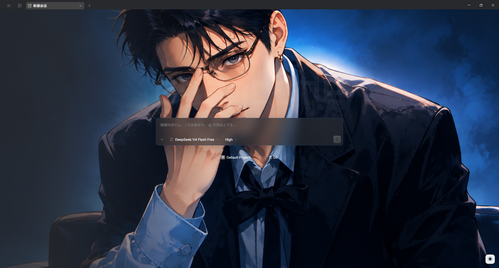
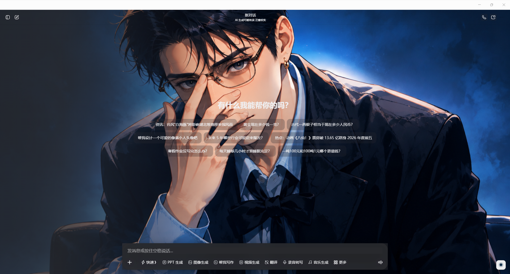
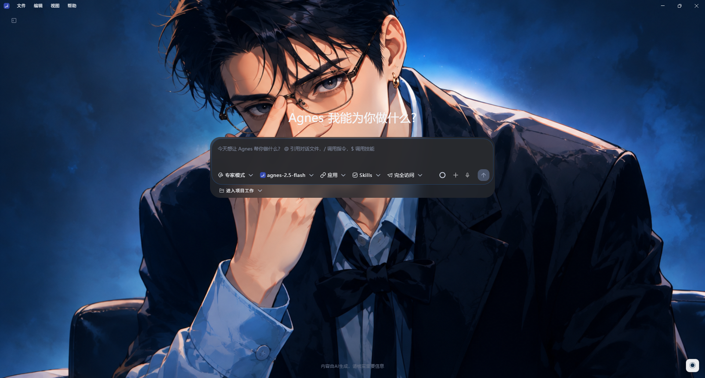
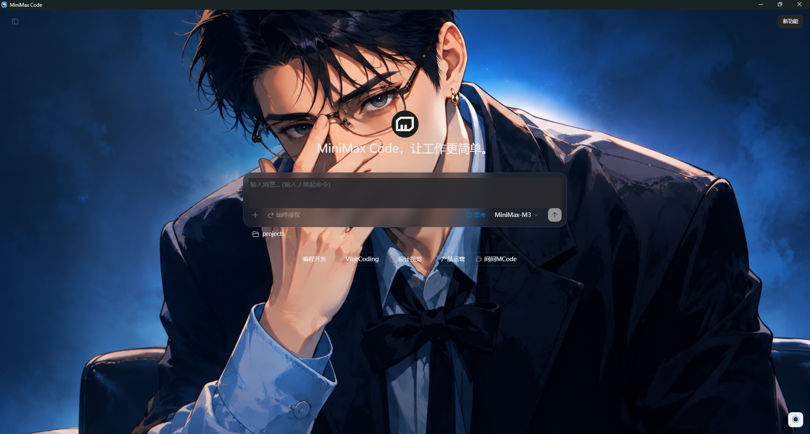
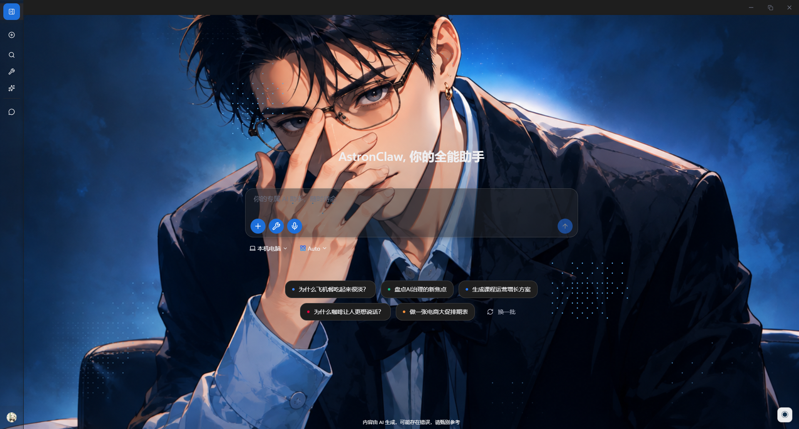
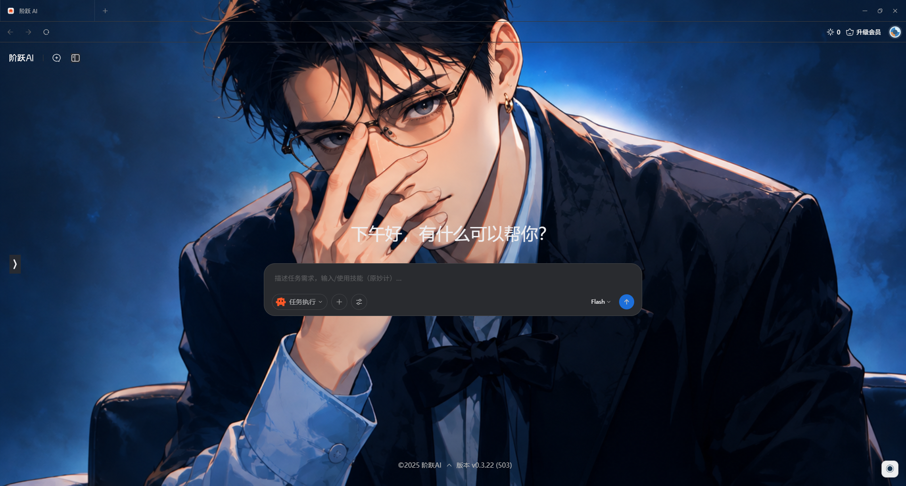
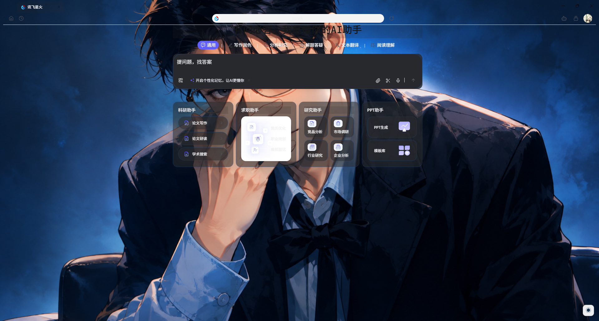
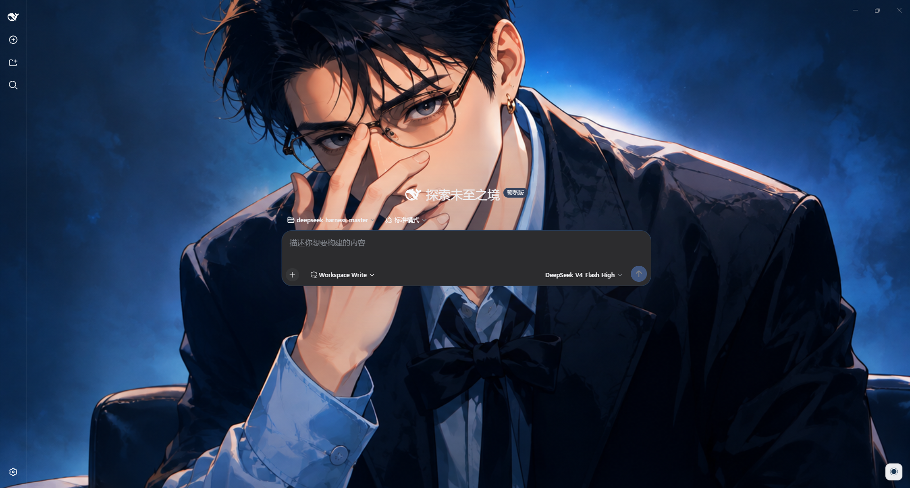

<h1 align="center">Dream Work Theme</h1>

<p align="center">
  <b>给 Electron Work 类应用换上你喜欢的主题 —— 不影响 Work 类应用功能使用</b>
</p>

<p align="center">
  <a href="LICENSE"></a>
  
  
  
</p>

<div align="center">

[简体中文](README.md) | [English](README_EN.md)

Dream Work Theme 是面向 Electron Work 类桌面应用的主题管理器。它负责发现已安装应用、以 Chrome DevTools Protocol（CDP）调试端口启动应用，并在运行时注入 CSS 和右下角主题菜单，不修改目标应用的 `.app / app.asar / WindowsApps`。

</div>

---

## 界面预览


<details>
<summary><b>点击展开更多应用</b></summary>


















</details>

## 支持应用

当前 `electron/manager/app-registry.ts` 注册了以下应用：

- WorkBuddy
- TRAE Work
- QoderWork
- CatPaw
- ZCode
- 千问办公（`QwenWorkCN`）
- HanaAgent
- Kimi Work
- OpenCode Desktop
- 豆包 Desktop
- AgnesCode
- MiniMax Code
- AstronClaw（讯飞星辰）
- SparkDesk（讯飞星火）
- StepFun（阶跃 AI）
- DeepSeek Harness（基于 [anywhere-labs/deepseek-harness-desktop](https://github.com/anywhere-labs/deepseek-harness-desktop) 构建）
- Codex / ChatGPT Desktop

部分应用使用首选调试端口；QoderWork、千问办公、OpenCode Desktop 和阶跃 AI 通过 `DevToolsActivePort` 获取运行时端口。HanaAgent 首选 `9346`，Kimi Work 首选 `9347`，豆包 Desktop 首选 `9349`，AgnesCode 使用 `9350`，MiniMax Code 首选 `9351`，AstronClaw 首选 `9352`，阶跃 AI 配置首选 `9353`，讯飞星火使用 `9354`，DeepSeek Harness 首选 `9355`。阶跃客户端会写入并使用自己的动态端口；星火接受固定 `--remote-debugging-port=9354`。启动前会通过真实 TCP bind 检查端口；若首选端口被占用或处于 Windows 幽灵监听状态，普通应用会自动顺延到可用端口，并把真实端口用于后续注入、状态查询和还原。Dream Work Theme 也会等待易重建的 renderer 稳定，并在运行期间自动恢复丢失的主题。

AgnesCode 正式版会主动移除普通的 `--remote-debugging-port` 参数。Dream Work Theme 通过 AgnesCode 内置的 Playwright 调试入口开启 CDP，并显式保留正式安装包中的 `resources/bin/agnesd.exe` 后端路径。该调试入口会让 AgnesCode 将当前会话标记为开发模式，因此其日志中可能出现不影响主题和聊天功能的更新配置检查错误。

Windows 上的 AgnesCode 还会在原生最小化、最大化和关闭按钮后绘制固定深色背景。首次应用主题时，Dream Work Theme 会备份 `AgnesCode.exe` 和目标 ASAR 代码片段，按 Electron 官方 fuse wire 格式关闭该应用的嵌入式 ASAR 完整性校验，并将原生标题栏覆盖色改为透明。AgnesCode 更新后会按新版本重新检测和应用补丁。

应用注册表集中声明 Windows 安装路径、macOS app bundle、Linux executable/desktop 文件候选以及主题兼容策略。普通应用在三个平台使用 detached spawn；Kimi Windows 版会把 Node/Electron/PowerShell 父进程误判为开发监督进程，因此 Windows 使用临时快捷方式交给 Explorer 启动，macOS 和 Linux 仍使用通用 detached spawn。

## 应用功能

- 扫描常见安装路径并发现支持的应用。
- 根据应用兼容性筛选主题画廊。
- 切换应用时保留当前主题选择和主题分页。
- 以 CDP 调试端口启动或重启目标应用。
- 注入背景图、应用专属样式和浮动主题菜单。
- 显示应用进程、主题注入、菜单和当前主题状态。
- 还原目标应用原生主题。
- 创建 Windows、macOS 和 Linux 的「应用 + 主题」快捷方式。
- 构建 Windows、macOS 和 Linux 发布包。

## 环境要求

- Node.js 22 或更高版本
- pnpm
- 至少一个受支持的 Electron 或定制 Chromium 应用

安装依赖：

```bash
git clone https://github.com/xxxhh336/dream-work-theme
cd dream-work-theme
pnpm install
```

Electron 二进制下载较慢或者出错，可先设置镜像：

```powershell
$env:ELECTRON_MIRROR="https://npmmirror.com/mirrors/electron/"
node node_modules/electron/install.js
```

## 本地开发

启动完整的 Vite + Electron 开发环境：

```bash
pnpm run electron:dev
```

`scripts/electron-dev.cjs` 统一管理开发进程：启动 Vite、等待 `dist-electron/main.js` 和 `dist-electron/preload.js` 就绪，然后只启动一个 Electron 实例。不要另外执行 `electron .`。

底层 Vite 命令仍可使用：

```bash
pnpm run dev
```

正常桌面开发应优先使用 `electron:dev`。`dev` 使用 vite-plugin-electron 的默认生命周期。

Electron 主进程和 preload 的 Vite 输出统一写入项目根目录 `dist-electron/`，与 `package.json.main` 保持一致。修改 `electron/manager/` 后，开发模式会重建并重启 Electron 主进程，不再使用 `renderer/dist-electron/` 中的旧副本。

`build:app` 会在打包前运行 `scripts/verify-package-bundle.cjs`，确认根 `dist-electron/main.js` 包含当前应用适配标记。`scripts/copy-electron-dist.js` 只校验 main/preload 并复制额外资源，不再删除根构建结果或从历史 `renderer/dist-electron/` 回拷旧 bundle。

其他检查命令：

```bash
pnpm run typecheck
pnpm run build:app
```

Vite 的 CJS API deprecation 当前只是警告，不会导致构建失败。

## 使用流程

1. 启动 Dream Work Theme。
2. 选择一个已安装应用。
3. 选择兼容主题。
4. 点击「应用主题」。
5. 在「应用设置」中查看进程、注入、菜单和当前主题状态。
6. 在目标应用右下角使用浮动菜单切换或还原主题。

应用主题时，Dream Work Theme 可能会重启目标应用，以便加入 CDP 调试端口。除 Windows 版 AgnesCode 的原生标题栏透明补丁外，主题只存在于运行时渲染进程，不会写入目标应用安装包。

右下角菜单最多显示 4 个快捷预置主题，不再固定绑定某几个主题 ID。Dream Work Theme 会按当前应用中的切换次数排序，次数相同时优先最近使用的主题；没有使用记录时从当前应用实际兼容的主题中补足，因此已删除或不兼容的主题不会显示空白入口。

- 使用频率按应用分别统计，同一主题在 HanaAgent、Codex 等应用中可以有不同排序。
- 从 Dream Work Theme 点击「应用主题」或从目标应用右下角菜单切换预置主题都会计数。
- 菜单初始化、HanaAgent renderer 重建、watcher 自动补注入、自定义图片切换和「还原主题」不会计数。
- 当前从 Dream Work Theme 应用的主题会进入本次菜单；后续菜单根据累计次数和最近使用时间重新排序。
- 使用记录保存在用户数据目录的 `theme-usage.json`。删除或停止兼容某个主题后，记录可以保留，但该主题不会出现在对应应用菜单中。

### HanaAgent 说明

- HanaAgent 启动期间可能重建 renderer。Dream Work Theme 会等待主 renderer 稳定，并在运行期间对新建或丢失主题的 renderer 自动补充注入。
- HanaAgent 使用稳定性优先的轻量菜单。右下角按钮的 `◉` 标识、尺寸和基础样式与其他应用一致，菜单打开后点击应用内其他空白位置会自动关闭。
- HanaAgent 的快捷预置主题与其他应用使用相同的高频排序规则，但使用次数按 HanaAgent 独立统计。
- HanaAgent 的自定义图片使用独立轻量实现，不直接复用曾导致崩溃的完整通用菜单脚本。支持 PNG、JPEG、WebP，导入后缩放压缩为 WebP、自动提取主题配色，最多保存 5 张，并支持切换和删除。
- 自定义图片由 Dream Work Theme 主进程集中保存到用户数据目录的 `custom-themes.json`，不依赖各目标应用相互隔离的 `localStorage`。在任一受支持应用上传或删除后，其他应用下次打开菜单或应用主题时会读取同一图片库。
- 当前选中的 HanaAgent 自定义图片会记录在本地，页面刷新或 renderer 重建后会自动恢复；从 Dream Work Theme 主动应用预置主题会覆盖该选择。
- 在 HanaAgent 右下角浮动菜单点击「还原主题」后，会记录用户的还原选择；守护器、页面刷新和 renderer 重建都不会再次自动显示主题。
- 需要重新启用主题时，可在 HanaAgent 浮动菜单选择一个主题，或回到 Dream Work Theme 点击「应用主题」。主动应用会清除还原状态。
- 从 Dream Work Theme 执行「还原主题」同样会停止 HanaAgent 的主题守护和持久注入，并保持原生主题。

### Kimi Work 说明

- Kimi Work 的 Work 与 Chat 是两个独立 renderer：`app://localhost/kimi-agent.html` 和 `https://www.kimi.com/`。Dream Work Theme 会在首次应用时同时注入两个页面。
- Kimi watcher 会监控 Work/Chat target 的创建、导航和重载；从 Work 切换到 Chat、切回 Work 或 renderer 重建后会自动恢复当前主题。
- Kimi 首次注入不再使用固定 3-4 秒等待。CDP renderer 通过短暂稳定确认后立即应用主题。
- Kimi 专属 CSS 会透明化首页、对话列表、顶部 publisher 区域以及输入框外层大背景，只为实际输入卡片、消息和必要控件保留轻透明底色。
- Kimi 的背景图不使用 `backdrop-filter: blur()`，避免 Work 与 Chat 页面中的图片被模糊。
- Windows 必须由 Explorer 成为 Kimi 的真实父进程，否则 Kimi 可能不注册内部 `app://` 协议并在启动后退出。该限制不适用于 macOS/Linux 的通用启动路径。

### OpenCode Desktop 说明

- Windows 安装路径 `C:\Users\<用户名>\AppData\Local\Programs\@opencode-aidesktop\OpenCode.exe` 已完成实机验证。
- OpenCode 使用 `oc://renderer/index.html` renderer，并通过 `%APPDATA%\ai.opencode.desktop\DevToolsActivePort` 暴露运行时 CDP 端口。
- 已验证从 Dream Work Theme 应用主题、右下角浮动菜单切换主题以及还原原生主题。
- OpenCode 首页和对话主面板使用相同的透明背景，输入框保留半透明玻璃底色以保证可读性。
- 启动器按完整路径结束 OpenCode Desktop 进程，不会误杀同名的 `opencode` CLI。

### 豆包 Desktop 说明

- Windows 版豆包是定制 Chromium 应用，实际运行文件位于 `%LOCALAPPDATA%\Doubao\Application\app\Doubao.exe`。
- 主聊天 renderer 为 `doubao://doubao-chat/chat`；Dream Work Theme 不向后台页和 launcher 辅助页注入主题。
- 豆包使用固定 CDP 端口 `9349`，主题仅在运行时注入，不修改豆包安装目录。
- 豆包原生界面只有亮色模式。暗色主题会重映射侧栏账号、搜索、历史对话、顶部标题、首页建议、对话内容以及输入框操作栏的 `dbx` / `s-color` 文字 token，避免黑色文字落在暗色背景上。
- 豆包在技能、新工作任务和历史对话等页面导航时会重新加载主 renderer。Dream Work Theme 使用页面级注入和 CDP 守护器，使主题、菜单和暗色文字适配在页面切换后自动恢复；执行还原主题时会停止守护器并记录还原状态。
- 新对话输入框的占位文字和底部操作图标会跟随暗色主题切换；AI 创作页会透明化原生白色内容容器，并适配 Tiptap 占位文字及图片/视频切换控件。
- AI 创作页的 sticky 标题栏会保持透明；对话页的长消息组不会套用通用消息气泡的背景模糊，避免大面积遮挡主题图片。
- 豆包完全跳过通用的 `[class*="message"]` 气泡模糊规则，并强制 `message-list-*` 内容层透明无滤镜；仅保留侧栏和底部输入框的局部玻璃效果。

### AgnesCode 说明

- Windows 实机验证版本为 AgnesCode `1.0.26`，安装路径为 `D:\Program Files\AgnesCode\AgnesCode.exe`，使用固定 CDP 端口 `9350`。
- AgnesCode 与普通 Electron 应用的第一处差异是：正式版主进程会主动删除 `remote-debugging-port`、`remote-debugging-address` 和 `remote-debugging-pipe`。Dream Work Theme 必须通过应用内置的 Playwright 调试入口设置 `AGNES_DEV=1`、`ENABLE_PLAYWRIGHT=1` 和 `PLAYWRIGHT_DEBUG_PORT=9350`。
- 开启 `AGNES_DEV` 会让正式安装包按开发环境寻找后端，因此启动器同时将 `AGNESD_BINARY` 固定到安装包内的 `resources/bin/agnesd.exe`。这也是日志中可能出现不影响聊天和主题功能的更新配置错误的原因。
- 第二处差异是右上角三个按钮使用 Electron 的原生 Window Controls Overlay，不属于网页 DOM。其他应用的标题栏通常是网页元素，或原生覆盖色本身可接受，因此 CSS 注入即可；AgnesCode 主进程却在每次创建、显示和加载窗口时调用 `setTitleBarOverlay()`，强制写入 `#2d323a` / `#22252a` 深色背景，网页 CSS 无法覆盖这块原生区域。
- 为透明化原生按钮背景，Dream Work Theme 会备份 `AgnesCode.exe` 为 `AgnesCode.exe.dream-work-original`，并将原始 ASAR 代码片段、偏移和 archive 大小记录到 `resources/app.asar.dream-work-titlebar.json`。随后按 Electron fuse wire 格式关闭 `EnableEmbeddedAsarIntegrityValidation`，再对 `app.asar` 中生成 `titleBarOverlay.color` 的代码做等长替换，将颜色改为 `#00000000`。
- 外部 `app.asar` 必须通过 Electron 的 `original-fs` 读取和写入；普通 `fs` 会把它当作 ASAR 虚拟目录，并产生 `ENOENT, not found in ...app.asar`。`original-fs` 在 Vite 主进程构建中保持 external，由 Electron 运行时提供。
- 补丁不会关闭 `OnlyLoadAppFromAsar`，也不会修改其他 fuse。AgnesCode 更新后，如果新版本仍能识别标题栏函数，启动器会重新备份并应用；如果结构改变，会停止写入并返回明确错误。
- AgnesCode 使用专属 `buildAgnesCodeCss()`，跳过通用 Work 的大面积渐变和模糊规则。主页面、搜索、定时任务、插件和设置 overlay/侧栏/内容层保持透明；输入框和插件卡片只保留局部轻透明底色。
- AgnesCode 的原生浅色/深色选择保存在 `localStorage.theme`；还原主题时会实时读取当前选择或 `use_system_theme`，移除注入产生的 `vscode-*` / `cb-*` 类，再恢复原生 `html.light` 或 `html.dark`，避免侧边栏和输入框出现深浅混合。
- 该原生标题栏补丁是目前唯一会修改目标应用安装文件的适配。其他受支持应用仍然只使用启动参数、CDP 和运行时 CSS/JavaScript 注入。

### MiniMax Code 说明

- Windows 实机验证版本为 MiniMax Code `3.0.60`，安装路径为 `D:\Program Files\MiniMax Code\MiniMax Code.exe`，首选 CDP 端口为 `9351`。
- 主 renderer 为 `app://./archon`。主题只注入该页面，不影响 `react-screenshots` 等辅助页面。
- MiniMax Code 使用专属 `buildMiniMaxCodeCss()`。主题背景挂载到 `html`、`body`、`#root` 和 `#__next`，应用壳、左侧栏、技能/定时任务等功能页主体及对话页底部大容器保持透明。
- 新建任务页和历史对话页的输入框统一使用主题 surface `62%` 半透明背景、`20px` 圆角、主题 accent `30%` 边框和 `16px` 模糊；外层遮挡保持透明。
- 还原主题时实时读取 `localStorage.theme`。当应用设置为跟随系统时，同时读取 `use_system_theme` 和 `prefers-color-scheme`，恢复 MiniMax Code 当前原生浅色或深色模式，而不是恢复首次注入时的旧快照。
- MiniMax Code 适配不修改安装文件，只使用启动参数、CDP 和运行时 CSS/JavaScript 注入。

### AstronClaw（讯飞星辰）说明

- Windows 实机验证版本为 AstronClaw `2.0.6`，安装路径为 `D:\Program Files\AstronClaw\AstronClaw.exe`，用户数据目录为 `%APPDATA%\astrondesktop`。
- 主 renderer 为 `file:///.../resources/app.asar/out/renderer/index.html`，页面标题为 `AstronDesktop`。主题注入只匹配该主页面，不影响辅助页面。
- AstronClaw 首选 CDP 端口为 `9352`。若该端口无法真实绑定，例如 Windows 仍报告不存在 PID 的幽灵监听，启动器会自动选择后续可用端口并将真实端口返回管理器；实机回归中成功回退到 `9353`。
- 专属 `buildAstronClawCss()` 会清除 `.workspace-frame` 原生深蓝渐变，并让应用主壳、任务主体、消息列表、消息正文、我的技能和灵感广场右侧画布保持透明、无大面积 `backdrop-filter`。侧栏仅保留轻透明底色，输入区只在实际 composer card 保留单层局部对比度。
- AstronClaw 的原生主题偏好不在 `localStorage.theme`，而由 `window.astronDesktop.settings.get().general.theme` 提供。还原时会实时读取 `light`、`dark` 或 `system`，并根据系统颜色偏好恢复正确的 `html.light` / `html.dark`，避免启动早期临时深色状态污染还原结果。
- 已验证主题应用返回 `applied: 1`，我的技能/灵感广场主体计算样式为透明且无滤镜，原生浅色和深色模式均可正确还原。

### SparkDesk（讯飞星火）说明

- Windows 实机验证版本为讯飞星火 `2.3.3.1`，安装路径为 `D:\Program Files\SparkDesk\SparkDesk.exe`，使用固定 CDP 端口 `9354`。
- 星火是 Electron `34.5.8` 应用。主窗口由多个 WebContents 组成：`index.html` 承载浏览器 Tab 和导航栏，`#desk` 承载新建对话与聊天内容，真正的“星火设置” Tab 使用 `#settings`。点击账号出现的 `#settings-panel?contentType=settings` 只是账号弹窗，不注入主题。
- `buildSparkDeskCss()` 采用与 StepFun 相同的连续背景思路。主壳和内容页各自使用固定 `html::before` 背景；聊天和设置内容页向上偏移 `80px`，与 Tab 栏和导航栏共享同一虚拟整窗背景坐标。
- 星火 watcher 同时维护主壳、所有 `#desk` 对话 Tab 和 `#settings` 设置页。新建 Tab、重新加载或后创建的设置页会自动继承当前主题；浮动主题菜单只显示在聊天页。
- 专属 CSS 会移除星火全屏容器原生 `blur(25px)`、白色渐变和大面积遮挡层，只在欢迎卡片、输入框和设置卡片保留局部主题 surface。
- 新建对话、已有对话和新建任务输入区会根据主题 surface 亮度自动反色：深色主题使用深色输入面板配亮色模型切换、文档、截图、语音和发送图标；亮色主题使用亮色面板配深色图标。
- “星火设置”页的用户资料卡、编辑资料按钮、菜单项、文字和图标均随主题深浅切换。账号弹窗保持原生显示，避免把弹窗误当作设置 Tab。
- 多 Tab 应用、切换和还原状态由主进程本机 `/app-state/sparkdesk` 状态与 SparkDesk watcher 收敛。还原会同步清理标题栏、导航栏、聊天 Tab 和设置页的主题样式，不修改星火安装文件。

### StepFun（阶跃 AI）说明

- Windows 实机验证版本为阶跃 AI `0.3.22`，安装路径为 `D:\Program Files\StepFun\StepFun\StepFun.exe`，用户数据目录为 `%APPDATA%\stepfun-desktop`。
- 阶跃 AI 会把真实 CDP 端口写入 `%APPDATA%\stepfun-desktop\DevToolsActivePort`，并可能忽略启动参数中的首选 `9353`。启动器读取文件后会验证 `/json/version` 和目标页面，不能使用陈旧端口。
- 客户端首次启动通常只进入托盘并创建调试服务，第二次激活才创建主窗口。Dream Work Theme 会在动态端口就绪后再次激活应用，并等待 `app://chat-web/` 主聊天页面。
- 阶跃主窗口由多个 WebContents 组成：`app://ui/pages/browser/` 承载 Tab 和导航栏，`app://chat-web/` 承载聊天内容，升级会员页面使用 `https://chat.stepfun.com/subscription`。主题 watcher 会同时维护这些目标，新建 Tab 和会员 Tab 会自动继承当前主题；主题菜单只显示在聊天页面。
- `buildStepFunCss()` 会透明化侧栏、激活 Tab、导航栏、聊天内容大容器和会员页全屏外壳，只为输入框、套餐卡片及必要控件保留局部对比度。
- 顶部宿主页与下方内容页使用统一的虚拟整窗背景坐标。Tab 和导航栏总高度为 `90px`；聊天/会员内容背景层向上偏移 `90px`，避免不同 WebContents 各自执行 `cover` 后出现图片重复或断层。
- 多 Tab 的主题与还原状态由 Dream Work Theme 主进程本机状态服务和 StepFun watcher 统一收敛。还原后聊天页、其他 Tab、顶部标签栏和导航栏会一起恢复阶跃原生深色模式，不残留透明背景或主题文字样式。
- 阶跃 AI 适配只使用启动参数、CDP 和运行时 CSS/JavaScript 注入，不修改安装目录。

### DeepSeek Harness 说明

- 本项目适配的是由 [anywhere-labs/deepseek-harness-desktop](https://github.com/anywhere-labs/deepseek-harness-desktop) 仓库构建的 DeepSeek Harness 桌面端，不代表所有名称相近的 DeepSeek 客户端都兼容。
- Windows 实机验证版本为 `0.1.0-rc.5`，安装路径为 `D:\Program Files\DeepSeek Harness\DeepSeek Harness.exe`，用户数据目录为 `%APPDATA%\@deepseek-ai\dsh-desktop`，首选 CDP 端口为 `9355`。
- 主 renderer 由桌面壳本地 Web 服务提供，URL 形如 `http://127.0.0.1:<动态 Web 端口>/?dsh-desktop-platform=win32`。Dream Work Theme 使用 `dsh-desktop-platform=` 作为目标特征，只向主页面注入。
- `buildDeepSeekHarnessCss()` 将主题 hero 挂载到固定 `html::before` 背景层，并透明化 `#root`、中央内容列和其主内容根节点，使背景图覆盖侧栏与主体。
- DeepSeek 专属规则跳过通用侧栏及消息/输入区毛玻璃。侧栏、`composerSeat` 和 `composerStack` 保持透明无滤镜，实际输入卡片保留原生局部背景以保证文字和控件可读。
- 移除侧栏祖先的 `backdrop-filter` 也避免它创建 fixed containing block；设置遮罩保持全窗口尺寸，`800px` 设置面板正常居中，不会被限制在 `280px` 侧栏内。
- DeepSeek 的原生明暗 palette 由 `body[data-ds-dark-theme]` 控制，而不是普通 `.dark` class。切换主题时会根据 manifest `surface` 亮度同步该属性，使 `--dsw-*` 文字、按钮、输入框和弹窗 token 一起切换；还原主题时恢复用户原先的 DeepSeek 明暗状态。
- 该适配只使用启动参数、CDP 和运行时 CSS/JavaScript 注入，不修改 DeepSeek Harness 的安装文件。

## 主题存储

主题按以下优先级加载：

1. 用户主题：`app.getPath('userData')/themes`
2. 内置主题：`app.getAppPath()/themes`

Windows 常见路径：

```text
开发模式内置主题：%PROJECTDIR%\themes
打包版内置主题：  resources\app.asar\themes
更新的用户主题：  %APPDATA%\dream-work-theme\themes
```

打包后的 `app.asar` 是构建时快照。删除源码 `themes/` 中的主题，不会改变已经生成的 EXE；必须重新打包才能更新内置主题。

`app.asar` 在运行时只读，因此社区下载主题写入用户数据目录。相同 ID 时，用户主题优先于内置主题。

## 主题格式

源码主题目录至少包含：

```text
themes/<theme-id>/
├── theme.json
├── theme.css
└── hero.png、hero.jpg、hero.webp 或 hero.gif
```

示例：

```json
{
  "schemaVersion": 1,
  "id": "my-theme",
  "name": "我的主题",
  "author": "用户",
  "hero": "hero.png",
  "colors": {
    "accent": "#24c9d7",
    "secondary": "#ef8fd3",
    "surface": "#f7fbff",
    "text": "#17344f"
  },
  "apps": {}
}
```

当前校验要求：`schemaVersion` 为 `1`，ID 只使用小写字母、数字和连字符，名称非空，hero 文件存在，并提供四个 `#RRGGBB` 颜色。

应用兼容性采用“注册表默认 + manifest 显式覆盖”模型：如果 `apps[appId].compat` 存在，则使用该值；未声明时读取 `app-registry.ts` 中应用的 `acceptsGenericThemes`。因此新增接受通用主题的应用无需批量修改历史 `theme.json`。只有主题需要拒绝某个应用或提供特殊 `layout` 时，才需要在 `apps` 中显式声明，例如：

```json
"apps": {
  "some-app": { "compat": false },
  "another-app": { "compat": true, "layout": "compact" }
}
```

主题制作流程见 [skills/custom-theme-maker/SKILL_CN.md](skills/custom-theme-maker/SKILL_CN.md)。

## 目标构建

构建应用代码和当前宿主平台配置的发布包：

```bash
pnpm run build
```

### Windows

```powershell
pnpm run build:win
pnpm run build:win:x64
```

产物：

```text
dist\Dream-Work-Theme-<version>-win-x64.exe
dist\win-unpacked\Dream Work Theme.exe
```

NSIS 安装器会在安装前后删除无用的 `%LOCALAPPDATA%\dream-work-theme-updater` 安装器缓存。即使安装目录选择 D 盘，Windows 系统盘仍需承担临时解压空间。建议 C 盘至少保留 1 GB，否则安装可能中途停止并留下不完整目录。

### macOS

```bash
pnpm run build:mac
pnpm run build:mac:arm64
pnpm run build:mac:x64
```

生成带架构名称的 DMG 和 ZIP。macOS 发布包必须在 macOS 主机或 macOS CI runner 上生成。

### Linux

```bash
pnpm run build:linux
pnpm run build:linux:x64
pnpm run build:linux:arm64
pnpm run build:linux:deb
pnpm run build:linux:deb:x64
pnpm run build:linux:deb:arm64
```

在 Linux 上生成 `AppImage + deb + tar.gz`；在 Windows 或 macOS 上只生成 `tar.gz`。AppImage 和 deb 必须在 Linux 主机运行。

本地构建 deb 需要 `fpm`。Ubuntu/Debian 可先安装 Ruby，再执行 `sudo gem install --no-document fpm`。GitHub Actions 工作流会自动安装。

仅构建 AppImage：

```bash
pnpm run build:linux:appimage:x64
pnpm run build:linux:appimage:arm64
```

Linux 打包会同时产生 `linux-unpacked`、约 700 MB 的中间 tar 和最终压缩包，需要较大临时空间。`scripts/package-linux.cjs` 会清理失败残留、要求至少 2 GB 空闲空间，并在 Windows 上自动选择空闲空间最多的磁盘作为临时目录。可通过 `DREAM_WORK_BUILD_TEMP` 手动指定。

## GitHub Actions 自动发布

仓库包含 `.github/workflows/release.yml`：

- 推送到 `main`：构建 Windows x64、Linux x64、macOS x64/arm64，并更新 `nightly` 预发布。
- 推送 `v*` 标签：创建对应正式 Release，例如 `v0.1.0`。
- Actions 页面手动运行：不填写标签时更新 `nightly`；填写标签时创建或更新指定正式 Release。

手动运行时，GitHub 页面顶部的 **Use workflow from** 必须选择 `main`，然后在 `release_tag` 中填写例如 `v0.1.2`。工作流会从 main 构建，并临时将构建版本设置为输入标签对应的版本；不要在 **Use workflow from** 中选择旧版本标签。

正式发布示例：

```bash
git tag v0.1.0
git push origin v0.1.0
```

Release 包含 NSIS、AppImage、deb、Linux tar.gz、macOS DMG 和 macOS ZIP。GitHub 仓库需要允许工作流拥有 `contents: write` 权限；工作流已声明该权限，公开仓库通常无需额外 Secret。

## 项目结构

```text
dream-work-theme/
├── electron/
│   ├── main.ts
│   ├── preload.ts
│   └── manager/
│       ├── app-registry.ts
│       ├── cdp.ts
│       ├── custom-theme-store.ts
│       ├── discovery.ts
│       ├── injector.ts
│       ├── launcher.ts
│       ├── shortcuts.ts
│       ├── theme-paths.ts
│       ├── theme-store.ts
│       └── theme-updater.ts
├── renderer/
│   ├── App.tsx
│   ├── components/
│   └── pages/
├── scripts/
│   ├── build-electron.cjs
│   ├── electron-dev.cjs
│   └── package-linux.cjs
├── shared/types.ts
├── skills/custom-theme-maker/
├── themes/
├── build/installer.nsh
├── package.json
└── vite.config.ts
```

## 添加新应用

1. 在 `electron/manager/app-registry.ts` 添加 Windows 安装路径、macOS bundle/executable、Linux executable/desktop 文件、渲染页 URL 特征、端口策略和 `acceptsGenericThemes`。
2. 发现、运行状态检查、进程终止和通用启动默认读取应用注册表；只有特殊安装结构、动态端口或父进程限制才需要修改 discovery/launcher。
3. 在 `electron/manager/injector.ts` 添加应用专属注入 CSS 与菜单行为。
4. 通用主题兼容应用不需要批量修改主题 manifest；只有兼容例外或特殊布局才写 `apps` 覆盖。
5. 在目标操作系统测试发现、启动、应用、renderer 导航/重建、刷新状态、还原、辅助窗口和应用退出场景。

## 已知限制

- 主题注入存在于目标应用运行中的渲染进程，退出应用后运行时注入自然消失。
- 目标应用升级可能改变 DOM，需要更新注入选择器。
- HanaAgent 会在启动和部分界面切换期间重建 renderer，因此首次应用主题可能比其他应用多等待数秒。
- Kimi Work 的 Work/Chat renderer 和页面 DOM 可能随客户端或网站更新变化，需要同步维护 URL hint 与透明层选择器。
- 阶跃 AI 使用多个独立 WebContents，并依赖 `app://chat-web/`、`app://ui/pages/browser/` 和会员订阅 URL。客户端更新若改变顶部 `90px` 布局、Tab/导航类名或订阅页模块类名，需要重新校准连续背景和透明层。
- 讯飞星火使用 `index.html`、`#desk` 和 `#settings` 多个 WebContents，并依赖当前 Tab/导航总高度 `80px`。客户端更新若改变 URL、标题栏高度、输入区 CSS Modules 类名前缀或设置页结构，需要重新校准 target 白名单、连续背景和深浅色控件规则。
- DeepSeek Harness 当前依赖 `dsh-desktop-platform=` URL 参数、CSS Modules 的 `_centerCol` / `_sidebarCol` / `_composerSeat` / `_composerStack` 结构，以及 `body[data-ds-dark-theme]` palette 属性。上游桌面端更新这些约定时需要重新校准目标识别、透明层、设置浮层和明暗同步。
- TRAE Work、QoderWork、CatPaw、ZCode、千问办公、阶跃 AI、讯飞星火和 DeepSeek Harness 的 macOS/Linux 注册表候选尚缺对应平台安装样本验证；实际产品若未发布该平台版本则无法发现。
- 未签名的 Windows/macOS 发布包可能触发系统安全提示。
- Windows 当前关闭了 EXE 元数据编辑，因此可能显示 Electron 默认图标和文件信息。
- 大量内置主题会显著增加安装包大小、构建时间和磁盘需求。

## 参考引用

- https://github.com/freestylefly/codex-themes
- https://github.com/Fei-Away/Codex-Dream-Skin
- https://github.com/shaozhengmao/workbuddy-dream-theme
- https://github.com/anywhere-labs/deepseek-harness-desktop

## AI辅助

GLM、Codex、DeepSeek

## 许可证

Apache License 2.0
