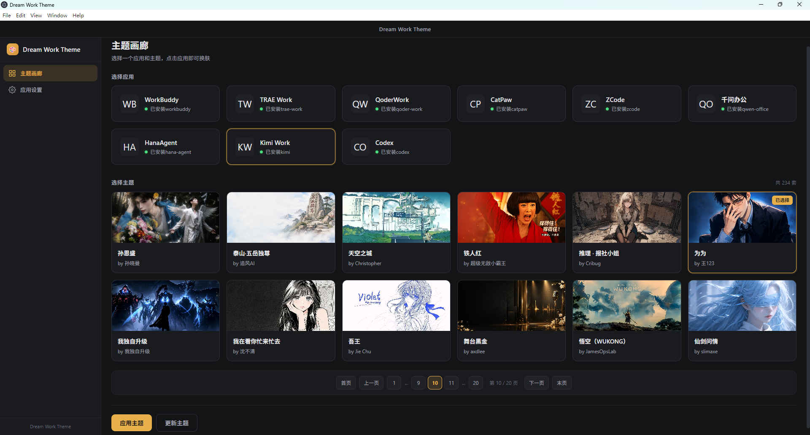
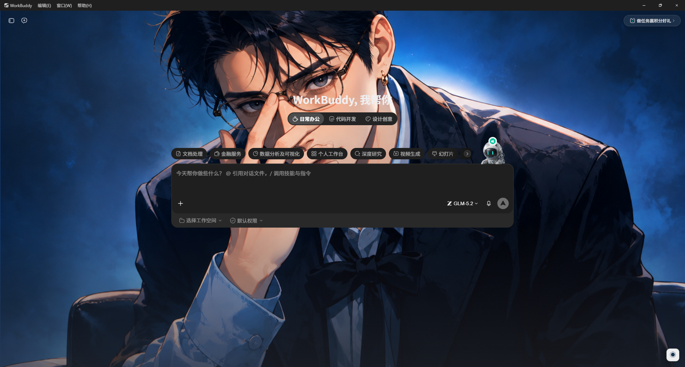
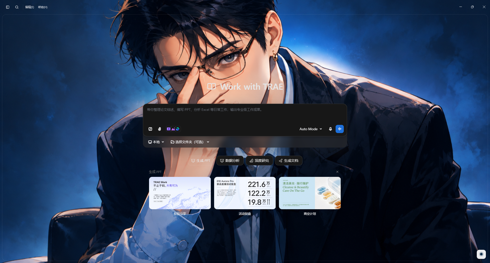
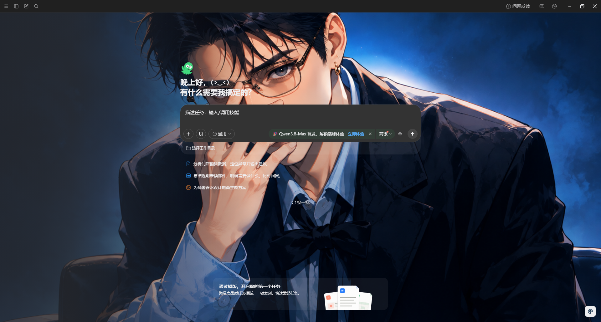
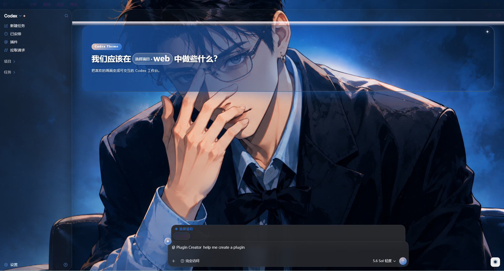
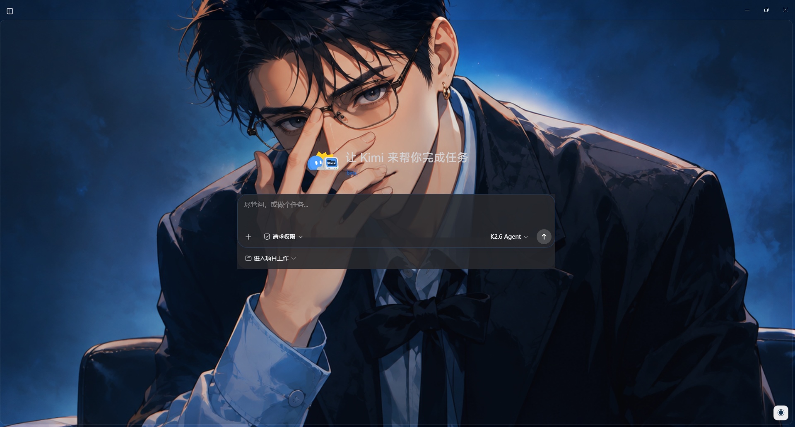

<h1 align="center">Dream Work Theme</h1>

<p align="center">
  <b>Replace the Electron Work application's with the theme you prefer - without affecting the functionality of the Work application's</b>
</p>

<p align="center">
  <a href="LICENSE"></a>
  
  
  
</p>

<div align="center">

[English](README_EN.md) | [简体中文](README.md)

Dream Work Theme is a desktop theme manager for supported Electron work applications. It discovers installed applications, launches them with Chrome DevTools Protocol (CDP) enabled, and injects runtime CSS plus a floating theme menu without modifying the target application's `.app / app.asar / WindowsApps`.

</div>

---

## Interface preview





<details>
<summary><b>Click to expand more applications</b></summary>











</details>

## Support Applications

The current application registry supports:

- WorkBuddy
- TRAE Work
- QoderWork
- CatPaw
- ZCode
- Qwen Office (`QwenWorkCN`)
- HanaAgent
- Kimi Work
- Codex / ChatGPT Desktop

Some applications use fixed debugging ports, while QoderWork and Qwen Office read their live port from `DevToolsActivePort`. HanaAgent uses port `9346`, and Kimi Work uses `9347`. Dream Work Theme waits for renderers that are likely to be recreated and restores missing injection while the application is running.

The application registry is the shared source for Windows installation paths, macOS app bundles, Linux executable/desktop-file candidates, and theme compatibility policy. Normal applications use detached spawn on all three platforms. Kimi on Windows mistakes Node, Electron, or PowerShell parents for a development supervisor, so Windows delegates its launch to Explorer through a temporary shortcut; macOS and Linux use the normal detached spawn path.

## Applications Features

- Discover supported applications from known installation paths.
- Filter the theme gallery by application compatibility.
- Preserve the selected theme and gallery page when switching applications.
- Launch or restart a target application with a CDP debugging port.
- Inject a background, application-specific CSS, and a floating theme menu.
- Query injection, menu, selected-theme, and process-running status.
- Restore the target application's native theme.
- Create Windows, macOS, and Linux application/theme shortcuts.
- Package Windows, macOS, and Linux releases with electron-builder.

## Requirements

- Node.js 22 or newer
- pnpm
- At least one supported Electron application

Install dependencies:

```bash
git clone https://github.com/xxxhh336/dream-work-theme
cd dream-work-theme
pnpm install
```

If the Electron binary download is slow, set a mirror before installing it:

```powershell
$env:ELECTRON_MIRROR="https://npmmirror.com/mirrors/electron/"
node node_modules/electron/install.js
```

## Development

Start the complete Vite and Electron development environment:

```bash
pnpm run electron:dev
```

`scripts/electron-dev.cjs` owns the development process lifecycle. It starts Vite, waits for `dist-electron/main.js` and `dist-electron/preload.js`, then starts exactly one Electron instance. Do not run `electron .` separately.

The lower-level Vite command is still available:

```bash
pnpm run dev
```

Use `electron:dev` for normal desktop development because `dev` relies on vite-plugin-electron's default lifecycle.

Other checks:

```bash
pnpm run typecheck
pnpm run build:app
```

The Vite CJS API deprecation message is currently a warning and does not fail the build.

## Usage

1. Start Dream Work Theme.
2. Select an installed application.
3. Select a compatible theme.
4. Click **Apply Theme**.
5. Open **Application Settings** to inspect injection, menu, current-theme, and process status.
6. Use the floating menu inside the target application to switch or restore themes.

Applying a theme may restart the target application so it can be launched with a debugging port. Runtime injection is not a modification of the target application's packaged files.

The floating menu shows up to four quick preset themes and is no longer tied to fixed theme IDs. Dream Work Theme ranks themes by switch count for the current application, using most recent use as the tie-breaker. With no history, it fills the menu from themes that are actually compatible with the current application, so removed or incompatible themes do not leave empty entries.

- Usage is tracked separately for each application, so the same theme can have different rankings in HanaAgent, Codex, and other applications.
- Applying a theme from Dream Work Theme or selecting a preset from the target application's floating menu increments its usage.
- Menu initialization, HanaAgent renderer recreation, watcher reinjection, custom-image selection, and **Restore Theme** do not increment usage.
- A theme explicitly applied from Dream Work Theme is included in the current menu; later menus are ordered from accumulated count and recency.
- Usage is stored in `theme-usage.json` under the user-data directory. A removed or newly incompatible theme may retain history but is excluded from that application's menu.

### HanaAgent Notes

- HanaAgent may recreate its renderer during startup. Dream Work Theme waits for the main renderer to stabilize and automatically restores injection when an active renderer is replaced or loses its injected theme.
- HanaAgent uses a stability-first lightweight menu. Its `◉` button marker, dimensions, and base styling match the other applications, and clicking elsewhere in the application closes an open menu.
- HanaAgent uses the same frequent-preset ranking as the other applications, while maintaining its own application-specific usage counts.
- HanaAgent custom images use an independent lightweight implementation rather than the complete generic menu script that previously caused crashes. PNG, JPEG, and WebP images are resized, compressed to WebP, assigned an automatically extracted palette, and can be switched or deleted, with up to five images stored.
- Dream Work Theme now stores custom images centrally in `custom-themes.json` under its user-data directory instead of relying on the isolated `localStorage` of each target application. Uploading or deleting an image in any supported application updates the library read by the other applications when their menu opens or a theme is applied.
- The selected HanaAgent custom image is persisted and restored after page reloads or renderer recreation. Explicitly applying a preset from Dream Work Theme overrides the custom selection.
- Clicking **Restore Theme** in HanaAgent's floating menu records the user's choice. The watcher, page reloads, and renderer recreation will not automatically display the theme again.
- To enable a theme again, select one from HanaAgent's floating menu or click **Apply Theme** in Dream Work Theme. An explicit apply clears the restored state.
- Using **Restore Theme** from Dream Work Theme also stops HanaAgent's theme watcher and persistent injection, leaving the native theme active.

### Kimi Work Notes

- Kimi Work uses separate renderers for Work and Chat: `app://localhost/kimi-agent.html` and `https://www.kimi.com/`. Dream Work Theme injects both during the initial apply.
- A Kimi watcher monitors Work/Chat target creation, navigation, and reloads. The current theme is restored after switching to Chat, switching back to Work, or renderer recreation.
- Initial Kimi injection no longer waits for fixed 3-4 second timers. The theme is applied immediately after a short CDP renderer stability check.
- Kimi-specific CSS makes the home page, conversation list, publisher area, and large input wrappers transparent while keeping a light surface on the actual editor card, messages, and controls that need contrast.
- Kimi backgrounds do not use `backdrop-filter: blur()`, preventing the image from becoming blurred in Work or Chat.
- On Windows, Explorer must be Kimi's real parent process. Otherwise Kimi can skip its internal `app://` registration and exit after startup. This restriction does not apply to the generic macOS/Linux launch path.

## Theme Storage

Themes are loaded from two locations, in priority order:

1. User themes: `app.getPath('userData')/themes`
2. Bundled themes: `app.getAppPath()/themes`

Typical Windows paths:

```text
Development bundled themes: %PROJECTDIR%\themes
Packaged bundled themes:    resources\app.asar\themes
Downloaded user themes:     %APPDATA%\dream-work-theme\themes
```

The packaged `app.asar` is a build snapshot. Deleting files from the source `themes/` directory does not change an already-built application. Rebuild the package to update bundled themes.

Updated themes are written to the user-data directory because `app.asar` is read-only at runtime. A user theme with the same ID takes precedence over a bundled theme.

## Theme Package

A source theme directory contains at least:

```text
themes/<theme-id>/
├── theme.json
├── theme.css
└── hero.png, hero.jpg, hero.webp, or hero.gif
```

Example manifest:

```json
{
  "schemaVersion": 1,
  "id": "my-theme",
  "name": "My Theme",
  "author": "User",
  "hero": "hero.png",
  "colors": {
    "accent": "#24c9d7",
    "secondary": "#ef8fd3",
    "surface": "#f7fbff",
    "text": "#17344f"
  },
  "apps": {}
}
```

Validation requires schema version `1`, a lowercase alphanumeric/hyphen ID, a non-empty name, a valid hero file, and four `#RRGGBB` colors.

Compatibility uses a registry-default plus manifest-override model. When `apps[appId].compat` exists, that explicit value wins; otherwise Dream Work Theme reads the application's `acceptsGenericThemes` setting from `app-registry.ts`. Adding another generic-theme application therefore does not require rewriting historical manifests. Add an `apps` entry only for an incompatibility or application-specific layout, for example:

```json
"apps": {
  "some-app": { "compat": false },
  "another-app": { "compat": true, "layout": "compact" }
}
```

See [skills/custom-theme-maker/SKILL.md](skills/custom-theme-maker/SKILL.md) for the theme-authoring workflow.

## Building

Build the application code and the host platform's configured package:

```bash
pnpm run build
```

### Windows

```powershell
pnpm run build:win
pnpm run build:win:x64
```

Output:

```text
dist\Dream-Work-Theme-<version>-win-x64.exe
dist\win-unpacked\Dream Work Theme.exe
```

The NSIS installer removes the obsolete `%LOCALAPPDATA%\dream-work-theme-updater` installer cache before and after installation. The installer still needs free space on the Windows system drive for temporary extraction. Keep at least 1 GB free; an installation can otherwise stop partway through even when the selected installation directory is on another drive.

### macOS

```bash
pnpm run build:mac
pnpm run build:mac:arm64
pnpm run build:mac:x64
```

Outputs are DMG and ZIP files named with the target architecture. macOS packages must be produced on a macOS host or macOS CI runner.

### Linux

```bash
pnpm run build:linux
pnpm run build:linux:x64
pnpm run build:linux:arm64
pnpm run build:linux:deb
pnpm run build:linux:deb:x64
pnpm run build:linux:deb:arm64
```

On Linux, these commands build `AppImage`, `deb`, and `tar.gz`. On Windows or macOS, they build only `tar.gz`; AppImage and deb packaging require a Linux host.

Local deb packaging requires `fpm`. On Ubuntu/Debian, install Ruby and run `sudo gem install --no-document fpm`. The GitHub Actions workflow installs it automatically.

Linux-only AppImage commands:

```bash
pnpm run build:linux:appimage:x64
pnpm run build:linux:appimage:arm64
```

Linux packaging requires substantial temporary space because it keeps `linux-unpacked`, an intermediate tar archive, and the final compressed archive. `scripts/package-linux.cjs` removes stale failed output, requires at least 2 GB free, and on Windows automatically selects the filesystem drive with the most free space for temporary files. Override it with `DREAM_WORK_BUILD_TEMP` when needed.

## GitHub Actions Releases

The repository includes `.github/workflows/release.yml`:

- Push to `main`: build Windows x64, Linux x64, and macOS x64/arm64, then replace the `nightly` prerelease.
- Push a `v*` tag: create the matching stable Release, for example `v0.1.0`.
- Manual dispatch: leave the tag empty for `nightly`, or enter a tag for a stable Release.

For a manual run, select `main` in **Use workflow from**, then enter a value such as `v0.1.2` in `release_tag`. The workflow builds main and temporarily sets the package version from that input. Do not select an old release tag in **Use workflow from**.

Stable release example:

```bash
git tag v0.1.0
git push origin v0.1.0
```

Release assets include NSIS, AppImage, deb, Linux tar.gz, macOS DMG, and macOS ZIP. The workflow requests `contents: write`; public repositories normally do not need an additional token Secret.

## Project Structure

```text
dream-work-theme/
├── electron/
│   ├── main.ts
│   ├── preload.ts
│   └── manager/
│       ├── app-registry.ts
│       ├── cdp.ts
│       ├── discovery.ts
│       ├── injector.ts
│       ├── launcher.ts
│       ├── shortcuts.ts
│       ├── theme-paths.ts
│       ├── theme-store.ts
│       └── theme-updater.ts
├── renderer/
│   ├── App.tsx
│   ├── components/
│   └── pages/
├── scripts/
│   ├── build-electron.cjs
│   ├── electron-dev.cjs
│   └── package-linux.cjs
├── shared/types.ts
├── skills/custom-theme-maker/
├── themes/
├── build/installer.nsh
├── package.json
└── vite.config.ts
```

## Adding an Application

1. Add Windows paths, macOS bundle/executable candidates, Linux executable/desktop files, renderer URL hints, port behavior, and `acceptsGenericThemes` to `electron/manager/app-registry.ts`.
2. Discovery, process checks, termination, and normal launching read the registry by default. Modify discovery or launcher code only for unusual installation layouts, dynamic ports, or parent-process restrictions.
3. Add application-specific injection CSS and menu behavior in `electron/manager/injector.ts`.
4. Do not rewrite theme manifests for generic compatibility; use explicit `apps` overrides only for exceptions or special layouts.
5. Test discovery, launch, apply, renderer navigation/recreation, status refresh, restore, auxiliary windows, and application exit on the target operating system.

## Known Limitations

- Injection exists in the target application's running renderer; closing the application removes the runtime injection.
- Application updates can change DOM selectors and require injector adjustments.
- HanaAgent recreates its renderer during startup and some view transitions, so the initial theme application can take several seconds longer than for other applications.
- Kimi Work's Work/Chat renderers and website DOM can change with client or site updates, requiring URL-hint and transparency-selector maintenance.
- The macOS/Linux registry candidates for TRAE Work, QoderWork, CatPaw, ZCode, and Qwen Office have not been verified against installed samples. Discovery is unavailable if the product does not publish a build for that platform.
- Unsigned Windows and macOS packages can trigger operating-system security warnings.
- Windows currently uses Electron's default executable icon and metadata because executable editing is disabled in the local build configuration.
- Large bundled theme collections produce large installers and require significant build and installation disk space.

## Reference

- https://github.com/freestylefly/codex-themes
- https://github.com/Fei-Away/Codex-Dream-Skin
- https://github.com/shaozhengmao/workbuddy-dream-theme

## AI Assistance

GLM、Codex、DeepSeek

## License

Apache License 2.0
