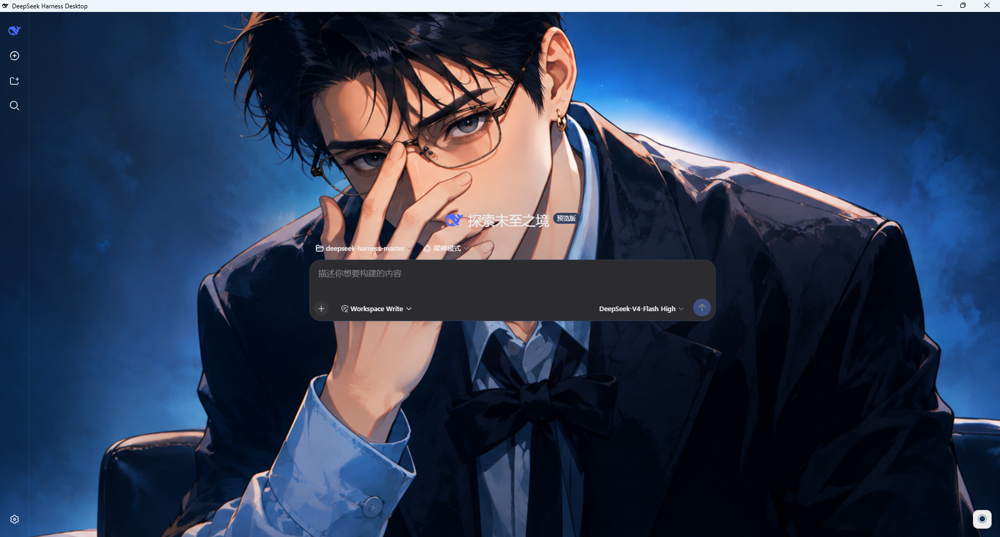
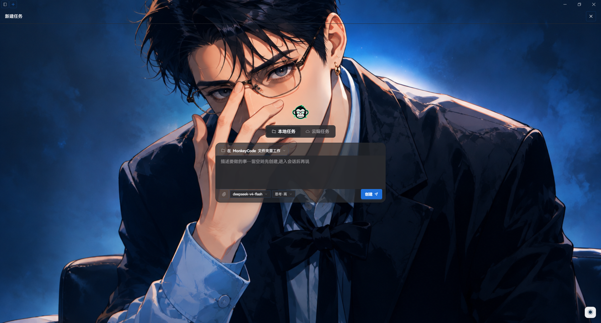

<h1 align="center">Dream Work Theme</h1>

<p align="center">
  <b>Replace the Electron Work application's with the theme you prefer - without affecting the functionality of the Work application's</b>
</p>

<p align="center">
  <a href="LICENSE"></a>
  
  
  
</p>

<div align="center">

[English](README_EN.md) | [简体中文](README.md)

Dream Work Theme is a desktop theme manager for supported Electron work applications. It discovers installed applications, launches them with Chrome DevTools Protocol (CDP) enabled, and injects runtime CSS plus a floating theme menu without modifying the target application's `.app / app.asar / WindowsApps`.

</div>

---

## Interface preview


<details>
<summary><b>Click to expand more applications</b></summary>






</details>

## Support Applications

The current application registry supports:

- WorkBuddy
- TRAE Work
- QoderWork
- CatPaw
- ZCode
- Qwen Office
- HanaAgent
- Kimi Work
- OpenCode Desktop
- Doubao Desktop
- AgnesCode
- MiniMax Code
- AstronClaw
- StepFun AI
- SparkDesk
- DeepSeek Harness / DSH Desktop (built from [anywhere-labs/deepseek-harness-desktop](https://github.com/anywhere-labs/deepseek-harness-desktop))
- MonkeyCode (Tauri / WebView2)
- Codex / ChatGPT Desktop

Some applications use preferred debugging ports, while QoderWork, Qwen Office, OpenCode Desktop, and StepFun AI read their live port from `DevToolsActivePort`. HanaAgent prefers `9346`, Kimi Work prefers `9347`, Doubao Desktop prefers `9349`, AgnesCode uses `9350`, MiniMax Code prefers `9351`, AstronClaw prefers `9352`, StepFun is registered with preferred port `9353`, SparkDesk uses `9354`, DeepSeek Harness prefers `9355`, and MonkeyCode prefers `9356`. StepFun writes and uses its own dynamic port, while SparkDesk accepts the fixed `--remote-debugging-port=9354` argument. Before launch, Dream Work Theme performs a real TCP bind check. If a preferred port is occupied or stuck in a Windows ghost-listener state, normal applications automatically advance to an available port and return that live port for injection, status queries, and restore operations. Dream Work Theme also waits for renderers that are likely to be recreated and restores missing injection while the application is running.

The AgnesCode release build actively removes a normal `--remote-debugging-port` argument. Dream Work Theme enables CDP through AgnesCode's built-in Playwright debugging entry point and explicitly preserves the packaged `resources/bin/agnesd.exe` backend path. This entry point marks the AgnesCode session as a development session, so its logs may contain update-configuration errors that do not affect theming or chat functionality.

On Windows, AgnesCode also paints a fixed dark background behind the native minimize, maximize, and close buttons. On first theme application, Dream Work Theme backs up `AgnesCode.exe` and the target ASAR code fragment, disables embedded ASAR integrity validation using Electron's official fuse-wire format, and changes the native title-bar overlay color to transparent. The patch is detected and reapplied against the new version after an AgnesCode update.

The application registry is the shared source for Windows installation paths, macOS app bundles, Linux executable/desktop-file candidates, and theme compatibility policy. Normal applications use detached spawn on all three platforms. Kimi on Windows mistakes Node, Electron, or PowerShell parents for a development supervisor, so Windows delegates its launch to Explorer through a temporary shortcut; macOS and Linux use the normal detached spawn path.

## Applications Features

- Discover supported applications from known installation paths.
- Filter the theme gallery by application compatibility.
- Preserve the selected theme and gallery page when switching applications.
- Launch or restart a target application with a CDP debugging port.
- Inject a background, application-specific CSS, and a floating theme menu.
- Query injection, menu, selected-theme, and process-running status.
- Restore the target application's native theme.
- Create Windows, macOS, and Linux application/theme shortcuts.
- Package Windows, macOS, and Linux releases with electron-builder.

## Requirements

- Node.js 22 or newer
- pnpm
- At least one supported Electron or customized Chromium application

Install dependencies:

```bash
git clone https://github.com/xxxhh336/dream-work-theme
cd dream-work-theme
pnpm install
```

If the Electron binary download is slow, set a mirror before installing it:

```powershell
$env:ELECTRON_MIRROR="https://npmmirror.com/mirrors/electron/"
node node_modules/electron/install.js
```

## Development

Start the complete Vite and Electron development environment:

```bash
pnpm run electron:dev
```

`scripts/electron-dev.cjs` owns the development process lifecycle. It starts Vite, waits for `dist-electron/main.js` and `dist-electron/preload.js`, then starts exactly one Electron instance. Do not run `electron .` separately.

The lower-level Vite command is still available:

```bash
pnpm run dev
```

Use `electron:dev` for normal desktop development because `dev` relies on vite-plugin-electron's default lifecycle.

The Electron main-process and preload Vite builds now write directly to the root `dist-electron/` directory referenced by `package.json.main`. Changes under `electron/manager/` rebuild and restart the development main process instead of leaving a stale copy under `renderer/dist-electron/`.

Before packaging, `build:app` runs `scripts/verify-package-bundle.cjs` to confirm that the root `dist-electron/main.js` contains current application-adapter markers. `scripts/copy-electron-dist.js` now validates main/preload and copies only extra resources; it no longer deletes the root build or restores a stale bundle from `renderer/dist-electron/`.

Other checks:

```bash
pnpm run typecheck
pnpm run build:app
```

The Vite CJS API deprecation message is currently a warning and does not fail the build.

## Usage

1. Start Dream Work Theme.
2. Select an installed application.
3. Select a compatible theme.
4. Click **Apply Theme**.
5. Open **Application Settings** to inspect injection, menu, current-theme, and process status.
6. Use the floating menu inside the target application to switch or restore themes.

Applying a theme may restart the target application so it can be launched with a debugging port. Except for the native transparent-title-bar patch required by AgnesCode on Windows, runtime injection does not modify the target application's packaged files.

The floating menu shows up to four quick preset themes and is no longer tied to fixed theme IDs. Dream Work Theme ranks themes by switch count for the current application, using most recent use as the tie-breaker. With no history, it fills the menu from themes that are actually compatible with the current application, so removed or incompatible themes do not leave empty entries.

- Usage is tracked separately for each application, so the same theme can have different rankings in HanaAgent, Codex, and other applications.
- Applying a theme from Dream Work Theme or selecting a preset from the target application's floating menu increments its usage.
- Menu initialization, HanaAgent renderer recreation, watcher reinjection, custom-image selection, and **Restore Theme** do not increment usage.
- A theme explicitly applied from Dream Work Theme is included in the current menu; later menus are ordered from accumulated count and recency.
- Usage is stored in `theme-usage.json` under the user-data directory. A removed or newly incompatible theme may retain history but is excluded from that application's menu.

### HanaAgent Notes

- HanaAgent may recreate its renderer during startup. Dream Work Theme waits for the main renderer to stabilize and automatically restores injection when an active renderer is replaced or loses its injected theme.
- HanaAgent uses a stability-first lightweight menu. Its `◉` button marker, dimensions, and base styling match the other applications, and clicking elsewhere in the application closes an open menu.
- HanaAgent uses the same frequent-preset ranking as the other applications, while maintaining its own application-specific usage counts.
- HanaAgent custom images use an independent lightweight implementation rather than the complete generic menu script that previously caused crashes. PNG, JPEG, and WebP images are resized, compressed to WebP, assigned an automatically extracted palette, and can be switched or deleted, with up to five images stored.
- Dream Work Theme now stores custom images centrally in `custom-themes.json` under its user-data directory instead of relying on the isolated `localStorage` of each target application. Uploading or deleting an image in any supported application updates the library read by the other applications when their menu opens or a theme is applied.
- The selected HanaAgent custom image is persisted and restored after page reloads or renderer recreation. Explicitly applying a preset from Dream Work Theme overrides the custom selection.
- Clicking **Restore Theme** in HanaAgent's floating menu records the user's choice. The watcher, page reloads, and renderer recreation will not automatically display the theme again.
- To enable a theme again, select one from HanaAgent's floating menu or click **Apply Theme** in Dream Work Theme. An explicit apply clears the restored state.
- Using **Restore Theme** from Dream Work Theme also stops HanaAgent's theme watcher and persistent injection, leaving the native theme active.

### Kimi Work Notes

- Kimi Work uses separate renderers for Work and Chat: `app://localhost/kimi-agent.html` and `https://www.kimi.com/`. Dream Work Theme injects both during the initial apply.
- A Kimi watcher monitors Work/Chat target creation, navigation, and reloads. The current theme is restored after switching to Chat, switching back to Work, or renderer recreation.
- Initial Kimi injection no longer waits for fixed 3-4 second timers. The theme is applied immediately after a short CDP renderer stability check.
- Kimi-specific CSS makes the home page, conversation list, publisher area, and large input wrappers transparent while keeping a light surface on the actual editor card, messages, and controls that need contrast.
- Kimi backgrounds do not use `backdrop-filter: blur()`, preventing the image from becoming blurred in Work or Chat.
- On Windows, Explorer must be Kimi's real parent process. Otherwise Kimi can skip its internal `app://` registration and exit after startup. This restriction does not apply to the generic macOS/Linux launch path.

### OpenCode Desktop Notes

- The Windows installation at `C:\Users\<user>\AppData\Local\Programs\@opencode-aidesktop\OpenCode.exe` has been verified on a real installation.
- OpenCode uses the `oc://renderer/index.html` renderer and exposes its runtime CDP port through `%APPDATA%\ai.opencode.desktop\DevToolsActivePort`.
- Applying a theme from Dream Work Theme, switching from the floating menu, and restoring the native theme have all been verified.
- The OpenCode home and conversation surfaces share the same transparent background, while the prompt card keeps a translucent glass surface for readability.
- Process shutdown is scoped to the full OpenCode Desktop executable path and does not terminate the same-named `opencode` CLI.

### Doubao Desktop Notes

- Doubao for Windows is a customized Chromium application whose actual runtime binary is `%LOCALAPPDATA%\Doubao\Application\app\Doubao.exe`.
- Its main chat renderer is `doubao://doubao-chat/chat`; Dream Work Theme does not inject into its background or launcher helper pages.
- Doubao uses fixed CDP port `9349`. Themes are injected at runtime without modifying the Doubao installation.
- Doubao only provides a native light appearance. Dark themes remap its `dbx` and `s-color` text tokens for the sidebar account, search, history, top title, home suggestions, conversation content, and prompt action bar so black text is not left on dark backgrounds.
- Navigating to Skills, New Work Task, or conversation history can reload Doubao's main renderer. Dream Work Theme combines document-level injection with a CDP watcher so the theme, menu, and dark-text adaptations return after navigation; restoring the native theme stops the watcher and records the restored state.
- The New Chat prompt placeholder and bottom action icons follow dark themes. The AI Creation page also makes its native white content container transparent and adapts the Tiptap placeholder plus Image/Video tabs.
- The AI Creation sticky title bar remains transparent. Long conversation message groups are excluded from the generic blurred bubble treatment so they do not obscure the theme artwork.
- Doubao skips the generic `[class*="message"]` bubble blur rule entirely, and its `message-list-*` content surface is forced transparent with no filter. Only the sidebar and bottom prompt retain local glass effects.

### AgnesCode Notes

- The verified Windows version is AgnesCode `1.0.26`, installed at `D:\Program Files\AgnesCode\AgnesCode.exe`, with fixed CDP port `9350`.
- The first difference from a normal Electron application is that the AgnesCode release main process actively removes `remote-debugging-port`, `remote-debugging-address`, and `remote-debugging-pipe`. Dream Work Theme must use its built-in Playwright debugging entry point with `AGNES_DEV=1`, `ENABLE_PLAYWRIGHT=1`, and `PLAYWRIGHT_DEBUG_PORT=9350`.
- Enabling `AGNES_DEV` makes the packaged application resolve its backend as a source development build, so the launcher also pins `AGNESD_BINARY` to the packaged `resources/bin/agnesd.exe`. This is why its logs can contain update-configuration errors that do not affect chat or theming.
- The second difference is that the three top-right buttons are Electron's native Window Controls Overlay, not DOM elements. Other applications either render their title bar in HTML or use an acceptable native overlay color, so CSS injection is enough. AgnesCode instead calls `setTitleBarOverlay()` whenever the window is created, shown, or loaded, forcing a `#2d323a` / `#22252a` background that webpage CSS cannot override.
- To make that native area transparent, Dream Work Theme backs up `AgnesCode.exe` as `AgnesCode.exe.dream-work-original` and records the original ASAR bytes, offset, and archive size in `resources/app.asar.dream-work-titlebar.json`. It then disables `EnableEmbeddedAsarIntegrityValidation` using Electron's fuse-wire format and performs an equal-length replacement of the code that produces `titleBarOverlay.color`, changing it to `#00000000`.
- The external `app.asar` must be accessed through Electron's `original-fs`. Normal `fs` treats it as an ASAR virtual directory and produces `ENOENT, not found in ...app.asar`. Vite therefore keeps `original-fs` external in the Electron main-process build, and Electron provides it at runtime.
- The patch leaves `OnlyLoadAppFromAsar` and every unrelated fuse unchanged. After an AgnesCode update, the launcher backs up and reapplies the patch if the new title-bar implementation is recognized; otherwise it stops before writing and returns an explicit error.
- AgnesCode uses the dedicated `buildAgnesCodeCss()` path and skips the generic Work gradients and large blur surfaces. Home, Search, Scheduled Tasks, Extensions, and the Settings overlay/sidebar/content surfaces remain transparent, while prompt and extension cards keep only local translucent contrast.
- AgnesCode stores its native light/dark selection in `localStorage.theme`. Restore reads the current selection or `use_system_theme`, removes injected `vscode-*` / `cb-*` classes, and restores native `html.light` or `html.dark` so the sidebar and prompt do not end up in a mixed light/dark state.
- This native title-bar patch is currently the only adapter that modifies target application files. Every other supported application still uses only launch parameters, CDP, and runtime CSS/JavaScript injection.

### MiniMax Code Notes

- The verified Windows version is MiniMax Code `3.0.60`, installed at `D:\Program Files\MiniMax Code\MiniMax Code.exe`, with preferred CDP port `9351`.
- Its main renderer is `app://./archon`. Theme injection is restricted to that page and excludes helper pages such as `react-screenshots`.
- MiniMax Code uses the dedicated `buildMiniMaxCodeCss()` path. The theme image is attached to `html`, `body`, `#root`, and `#__next`, while the application shell, sidebar, feature-page canvas, and large conversation-footer wrapper remain transparent.
- The New Task and conversation composers share a `62%` translucent theme surface, `20px` radius, `30%` accent border, and `16px` blur. Their outer scrims remain transparent.
- Restore reads `localStorage.theme` at action time. When the application follows the operating system, it also reads `use_system_theme` and `prefers-color-scheme`, restoring the current native light or dark mode instead of an outdated injection-time snapshot.
- The MiniMax Code adapter does not modify installed files; it only uses launch arguments, CDP, and runtime CSS/JavaScript injection.

### AstronClaw Notes

- The verified Windows version is AstronClaw `2.0.6`, installed at `D:\Program Files\AstronClaw\AstronClaw.exe`, with user data under `%APPDATA%\astrondesktop`.
- Its main renderer is `file:///.../resources/app.asar/out/renderer/index.html`, titled `AstronDesktop`. Injection is restricted to that main page.
- AstronClaw prefers CDP port `9352`. If the port cannot be bound, including a Windows ghost listener owned by a PID that no longer exists, the launcher selects the next available port and returns it to the manager. The real-device regression test successfully fell back to `9353`.
- The dedicated `buildAstronClawCss()` path removes the native dark-blue `.workspace-frame` gradient and keeps the application shell, task canvas, message list, message bodies, My Skills page, and Inspiration Gallery canvas transparent without large `backdrop-filter` surfaces. The sidebar retains only a light translucent tint, and only the actual composer card keeps local contrast.
- AstronClaw does not store its native preference in `localStorage.theme`. Restore reads `window.astronDesktop.settings.get().general.theme` at action time and resolves `light`, `dark`, or `system` to the correct native `html.light` / `html.dark` state, avoiding the temporary dark startup state captured by an early injection snapshot.
- Theme application has been verified with `applied: 1`; the My Skills and Inspiration Gallery canvas computes to a transparent, filter-free surface, and both native light and dark restoration paths have been verified.

### SparkDesk Notes

- The verified Windows version is SparkDesk `2.3.3.1`, installed at `D:\Program Files\SparkDesk\SparkDesk.exe`, using fixed CDP port `9354`.
- SparkDesk is an Electron `34.5.8` application with multiple WebContents. `index.html` owns the browser tabs and navigation, `#desk` owns new-chat and conversation content, and the real Spark Settings tab uses `#settings`. The `#settings-panel?contentType=settings` page opened from the account control is only an account popover and is intentionally not themed.
- `buildSparkDeskCss()` uses the same continuous-background principle as StepFun. The shell and content pages each render a fixed `html::before` background; chat and settings content move it upward by `80px` to share one virtual full-window coordinate system with the tab and navigation bars.
- The SparkDesk watcher maintains the shell, every `#desk` conversation tab, and the `#settings` page. New tabs, reloads, and settings pages created later inherit the active theme automatically. The floating menu is shown only on chat pages.
- SparkDesk-specific CSS removes the native full-window `blur(25px)`, white gradients, and large opaque scrims while retaining local theme surfaces on welcome cards, the composer, and settings cards.
- The new-chat, conversation, and task composers invert controls from the theme surface luminance: dark themes use a dark composer with light model, document, screenshot, voice, and send controls; light themes use a light composer with dark controls.
- The Spark Settings user card, Edit Profile button, menu rows, text, and icons follow the theme's light/dark palette. The account popover remains native so it is not confused with the settings tab.
- Multi-tab apply, switching, and restore converge through the local `/app-state/sparkdesk` state and the SparkDesk watcher. Restore clears the shell, navigation, chat tabs, and settings page without modifying installed SparkDesk files.

### StepFun AI Notes

- The verified Windows version is StepFun AI `0.3.22`, installed at `D:\Program Files\StepFun\StepFun\StepFun.exe`, with user data under `%APPDATA%\stepfun-desktop`.
- StepFun writes its live CDP port to `%APPDATA%\stepfun-desktop\DevToolsActivePort` and can ignore the preferred `9353` launch argument. The launcher validates `/json/version` and the required renderer targets instead of trusting a stale file.
- The first launch commonly creates only the tray process and debugging service. Dream Work Theme activates StepFun a second time after the dynamic endpoint is live, then waits for the `app://chat-web/` chat renderer.
- The main window spans multiple WebContents: `app://ui/pages/browser/` owns tabs and navigation, `app://chat-web/` owns chat content, and the membership page uses `https://chat.stepfun.com/subscription`. The StepFun watcher maintains all of them, so normal tabs and membership tabs inherit the active theme. The floating menu is shown only on chat pages.
- `buildStepFunCss()` makes the sidebar, active tab, navigation bar, large chat surfaces, and membership-page shell transparent while retaining local contrast on the prompt, subscription cards, and controls that need it.
- The shell and content renderers share one virtual full-window background coordinate system. Tabs plus navigation occupy `90px`; chat and membership background layers extend upward by `90px`, preventing separate WebContents from independently centering and duplicating the same `cover` image.
- Multi-tab apply and restore state converges through the Dream Work Theme main-process local state service and the StepFun watcher. Restore clears the theme from every chat tab and restores the tab strip, navigation bar, text, and native StepFun dark appearance without residual transparent surfaces.
- The StepFun adapter uses only launch arguments, CDP, and runtime CSS/JavaScript injection. It does not modify installed files.

### DeepSeek Harness / DSH Desktop Notes

- This adapter targets the DeepSeek Harness build produced from [anywhere-labs/deepseek-harness-desktop](https://github.com/anywhere-labs/deepseek-harness-desktop). Compatibility is not implied for every similarly named DeepSeek client.
- The verified current Windows version is DSH Desktop `2.0.0`, installed at `D:\Program Files\DSH Desktop\DSH Desktop.exe`, with user data under `%APPDATA%\DSH Desktop`. The older DeepSeek Harness `0.1.0-rc.5` path `D:\Program Files\DeepSeek Harness\DeepSeek Harness.exe` and `%APPDATA%\@deepseek-ai\dsh-desktop` remain supported. Both use preferred CDP port `9355`.
- The application picker displays `DSH Desktop`, prefers the new `DSH Desktop.exe`, and falls back to the legacy `DeepSeek Harness.exe`. Windows path-scoped process termination matches the real executable path instead of a fixed legacy process name.
- The desktop shell serves its main renderer from a local HTTP endpoint such as `http://127.0.0.1:<dynamic-web-port>/?dsh-desktop-platform=win32`. Injection matches the `dsh-desktop-platform=` marker.
- DSH Desktop `2.0.0` also adds `dsh-desktop-mode=compatibility` to the renderer URL; the existing target hint continues to match it.
- `buildDeepSeekHarnessCss()` mounts the hero on a fixed `html::before` layer and makes the root, center column, and content roots transparent so one background spans the sidebar and main content.
- DeepSeek skips the generic sidebar and composer glass rules. The sidebar, `composerSeat`, and `composerStack` are transparent and filter-free, while the actual composer card retains native local contrast.
- DSH Desktop `2.0.0` adds an opaque content root inside the otherwise transparent `*_sidebarCol`. The adapter also makes the direct `data-slot="sidebar"` content root transparent so the hero remains visible through the full sidebar, while local controls such as the New Session button retain their own contrast backgrounds.
- Removing the sidebar ancestor's `backdrop-filter` also prevents it from becoming a fixed-position containing block. The settings overlay remains full-window and its `800px` panel stays centered instead of being constrained to the `280px` sidebar.
- DeepSeek selects its native palette with `body[data-ds-dark-theme]`, not only `.dark` classes. Theme switching synchronizes this attribute from the manifest surface luminance so all `--dsw-*` text and control tokens follow light or dark mode. Restore reinstates the user's original native DeepSeek palette.
- The adapter uses launch arguments, CDP, and runtime CSS/JavaScript injection only. It does not modify installed DeepSeek Harness files.

### MonkeyCode Notes

- MonkeyCode is not Electron. It uses Tauri `2.11.5`, Rust, Wry `0.55.1`, and Microsoft Edge WebView2. The verified Windows path is `D:\Program Files\MonkeyCode\monkeycode-desktop.exe`.
- Dream Work Theme enables standard WebView2 CDP through `WEBVIEW2_ADDITIONAL_BROWSER_ARGUMENTS=--remote-debugging-port=<port>`, preferring port `9356`; the normal Electron executable argument is not used.
- The main window URL is exactly `http://tauri.localhost/`, while the desktop-pet window is `http://tauri.localhost/pet.html`. Full theme CSS and the menu are injected only into the main window.
- `buildMonkeyCodeCss()` maps DaisyUI base/content/accent tokens, mounts the hero on fixed `html::before`, and makes large titlebar/sidebar/main surfaces transparent. Inputs, chat cards, dialogs, and dropdowns retain translucent contrast surfaces.
- The far-left `nav.w-rail` and the full-height chapter-navigation dropdown rail at the conversation edge remain fully transparent so the hero stays continuous. Chapter popup content and the bottom composer retain local contrast surfaces.
- Light and dark switching changes only runtime `html[data-theme]` and the inline background. It does not overwrite MonkeyCode's persistent `mc.theme` or `mc.themeBg` settings. The native snapshot survives WebView reloads and restore reinstates the original `monkeycode` or `monkeycode-dark` state.
- Strict target filtering excludes the pet target. The main-process watcher restores an active theme and menu after reload, while a restored marker keeps reloads fully native after restore.
- MonkeyCode styling is version-gated from the Windows executable `ProductVersion`. Builds before `26082107` retain the legacy rail/aside/chapter-navigation rules. Build `26082107` and later set `data-dream-monkeycode-modern="true"` and additionally clear the new `mc-workbench-surface-200` sidebar, `mc-workbench-surface-300` workbench layer, and `mc-workbench-surface-100` panes so the new left and right surfaces do not cover the hero.
- The `26082107` New Task pane adds a direct full-height scrolling `bg-base-100` body. The modern rule clears only that direct pane child, preserving the centered task composer, textarea, model selector, and runtime controls as local contrast surfaces.
- The adapter uses only process environment, CDP, and runtime CSS/JavaScript injection. It does not modify the MonkeyCode executable or embedded resources.

## Theme Storage

Themes are loaded from two locations, in priority order:

1. User themes: `app.getPath('userData')/themes`
2. Bundled themes: `app.getAppPath()/themes`

Typical Windows paths:

```text
Development bundled themes: %PROJECTDIR%\themes
Packaged bundled themes:    resources\app.asar\themes
Downloaded user themes:     %APPDATA%\dream-work-theme\themes
```

The packaged `app.asar` is a build snapshot. Deleting files from the source `themes/` directory does not change an already-built application. Rebuild the package to update bundled themes.

Updated themes are written to the user-data directory because `app.asar` is read-only at runtime. A user theme with the same ID takes precedence over a bundled theme.

## Theme Package

A source theme directory contains at least:

```text
themes/<theme-id>/
├── theme.json
├── theme.css
└── hero.png, hero.jpg, hero.webp, or hero.gif
```

Example manifest:

```json
{
  "schemaVersion": 1,
  "id": "my-theme",
  "name": "My Theme",
  "author": "User",
  "hero": "hero.png",
  "colors": {
    "accent": "#24c9d7",
    "secondary": "#ef8fd3",
    "surface": "#f7fbff",
    "text": "#17344f"
  },
  "apps": {}
}
```

Validation requires schema version `1`, a lowercase alphanumeric/hyphen ID, a non-empty name, a valid hero file, and four `#RRGGBB` colors.

Compatibility uses a registry-default plus manifest-override model. When `apps[appId].compat` exists, that explicit value wins; otherwise Dream Work Theme reads the application's `acceptsGenericThemes` setting from `app-registry.ts`. Adding another generic-theme application therefore does not require rewriting historical manifests. Add an `apps` entry only for an incompatibility or application-specific layout, for example:

```json
"apps": {
  "some-app": { "compat": false },
  "another-app": { "compat": true, "layout": "compact" }
}
```

See [skills/custom-theme-maker/SKILL.md](skills/custom-theme-maker/SKILL.md) for the theme-authoring workflow.

## Building

Build the application code and the host platform's configured package:

```bash
pnpm run build
```

### Windows

```powershell
pnpm run build:win
pnpm run build:win:x64
```

Output:

```text
dist\Dream-Work-Theme-<version>-win-x64.exe
dist\win-unpacked\Dream Work Theme.exe
```

The NSIS installer removes the obsolete `%LOCALAPPDATA%\dream-work-theme-updater` installer cache before and after installation. The installer still needs free space on the Windows system drive for temporary extraction. Keep at least 1 GB free; an installation can otherwise stop partway through even when the selected installation directory is on another drive.

### macOS

```bash
pnpm run build:mac
pnpm run build:mac:arm64
pnpm run build:mac:x64
```

Outputs are DMG and ZIP files named with the target architecture. macOS packages must be produced on a macOS host or macOS CI runner.

### Linux

```bash
pnpm run build:linux
pnpm run build:linux:x64
pnpm run build:linux:arm64
pnpm run build:linux:deb
pnpm run build:linux:deb:x64
pnpm run build:linux:deb:arm64
```

On Linux, these commands build `AppImage`, `deb`, and `tar.gz`. On Windows or macOS, they build only `tar.gz`; AppImage and deb packaging require a Linux host.

Local deb packaging requires `fpm`. On Ubuntu/Debian, install Ruby and run `sudo gem install --no-document fpm`. The GitHub Actions workflow installs it automatically.

Linux-only AppImage commands:

```bash
pnpm run build:linux:appimage:x64
pnpm run build:linux:appimage:arm64
```

Linux packaging requires substantial temporary space because it keeps `linux-unpacked`, an intermediate tar archive, and the final compressed archive. `scripts/package-linux.cjs` removes stale failed output, requires at least 2 GB free, and on Windows automatically selects the filesystem drive with the most free space for temporary files. Override it with `DREAM_WORK_BUILD_TEMP` when needed.

## GitHub Actions Releases

The repository includes `.github/workflows/release.yml`:

- Push to `main`: build Windows x64, Linux x64, and macOS x64/arm64, then replace the `nightly` prerelease.
- Push a `v*` tag: create the matching stable Release, for example `v0.1.0`.
- Manual dispatch: leave the tag empty for `nightly`, or enter a tag for a stable Release.

For a manual run, select `main` in **Use workflow from**, then enter a value such as `v0.1.2` in `release_tag`. The workflow builds main and temporarily sets the package version from that input. Do not select an old release tag in **Use workflow from**.

Stable release example:

```bash
git tag v0.1.0
git push origin v0.1.0
```

Release assets include NSIS, AppImage, deb, Linux tar.gz, macOS DMG, and macOS ZIP. The workflow requests `contents: write`; public repositories normally do not need an additional token Secret.

## Project Structure

```text
dream-work-theme/
├── electron/
│   ├── main.ts
│   ├── preload.ts
│   └── manager/
│       ├── app-registry.ts
│       ├── cdp.ts
│       ├── custom-theme-store.ts
│       ├── discovery.ts
│       ├── injector.ts
│       ├── launcher.ts
│       ├── shortcuts.ts
│       ├── theme-paths.ts
│       ├── theme-store.ts
│       └── theme-updater.ts
├── renderer/
│   ├── App.tsx
│   ├── components/
│   └── pages/
├── scripts/
│   ├── build-electron.cjs
│   ├── electron-dev.cjs
│   └── package-linux.cjs
├── shared/types.ts
├── skills/custom-theme-maker/
├── themes/
├── build/installer.nsh
├── package.json
└── vite.config.ts
```

## Adding an Application

1. Add Windows paths, macOS bundle/executable candidates, Linux executable/desktop files, renderer URL hints, port behavior, and `acceptsGenericThemes` to `electron/manager/app-registry.ts`.
2. Discovery, process checks, termination, and normal launching read the registry by default. Modify discovery or launcher code only for unusual installation layouts, dynamic ports, or parent-process restrictions.
3. Add application-specific injection CSS and menu behavior in `electron/manager/injector.ts`.
4. Do not rewrite theme manifests for generic compatibility; use explicit `apps` overrides only for exceptions or special layouts.
5. Test discovery, launch, apply, renderer navigation/recreation, status refresh, restore, auxiliary windows, and application exit on the target operating system.

## Known Limitations

- Injection exists in the target application's running renderer; closing the application removes the runtime injection.
- Application updates can change DOM selectors and require injector adjustments.
- HanaAgent recreates its renderer during startup and some view transitions, so the initial theme application can take several seconds longer than for other applications.
- Kimi Work's Work/Chat renderers and website DOM can change with client or site updates, requiring URL-hint and transparency-selector maintenance.
- StepFun AI uses multiple WebContents and depends on the `app://chat-web/`, `app://ui/pages/browser/`, and membership subscription URLs. Client updates that change the `90px` shell geometry, tab/navigation classes, or subscription CSS-module classes require the continuous-background and transparency selectors to be recalibrated.
- SparkDesk uses separate `index.html`, `#desk`, and `#settings` WebContents and currently depends on an `80px` tab/navigation offset. Client updates that change these URLs, shell height, composer CSS-module prefixes, or settings structure require target filtering, continuous backgrounds, and light/dark control mappings to be recalibrated.
- DSH Desktop currently depends on the `dsh-desktop-platform=` URL marker, the `_centerCol` / `_sidebarCol` / `_composerSeat` / `_composerStack` CSS-module structures, and the `body[data-ds-dark-theme]` palette attribute. Version `2.0.0` confirms these stable suffixes still work. Upstream changes to these contracts require target, transparency, settings-overlay, and palette synchronization adjustments.
- MonkeyCode currently depends on the Tauri main URL `http://tauri.localhost/`, DaisyUI base/content tokens, and WebView2 debugging environment support. Changes to its WebView URL, token system, or debugging policy require recalibration.
- The macOS/Linux registry candidates for TRAE Work, QoderWork, CatPaw, ZCode, Qwen Office, StepFun AI, SparkDesk, and DeepSeek Harness have not been verified against installed samples. Discovery is unavailable if the product does not publish a build for that platform.
- Unsigned Windows and macOS packages can trigger operating-system security warnings.
- Windows currently uses Electron's default executable icon and metadata because executable editing is disabled in the local build configuration.
- Large bundled theme collections produce large installers and require significant build and installation disk space.

## Reference

- https://github.com/freestylefly/codex-themes
- https://github.com/Fei-Away/Codex-Dream-Skin
- https://github.com/shaozhengmao/workbuddy-dream-theme
- https://github.com/anywhere-labs/deepseek-harness-desktop

## AI Assistance

GLM、Codex、DeepSeek

## License

Apache License 2.0
